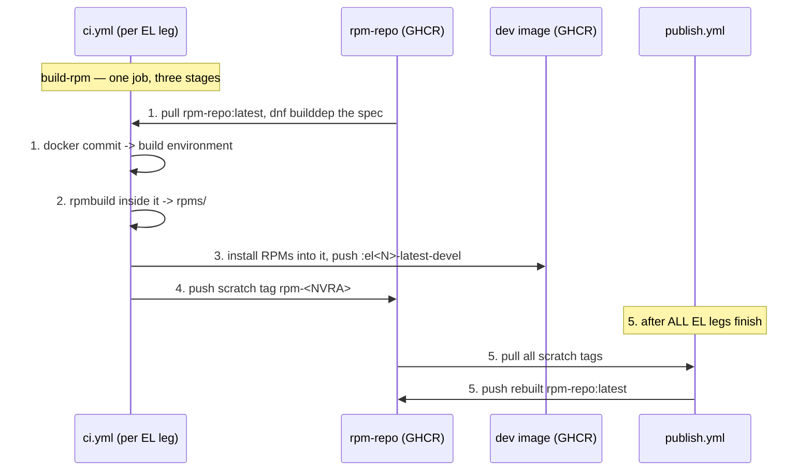

# gemini-rtsw-ci

Shared CI scripts for building RPMs and Docker dev environments. Used as a git submodule in each project repo. Every push to `main` builds the package's RPM, publishes it to the shared rpm-repo, and pushes a Docker dev image to GHCR — no flags, no conditions.

For step-by-step guides — EPICS packages, non-EPICS packages, and shipping a container — see [WORKFLOW.md](WORKFLOW.md).

## How the pipeline works

Each project repo pins this repo as a submodule and calls its reusable workflows. Dependencies and published RPMs both flow through one shared `rpm-repo` image on GHCR; dev images are pushed per project.


```mermaid
flowchart LR
  subgraph project["project repo"]
    spec[".spec"]
    sub["gemini-rtsw-ci<br/>(submodule)"]
    wf[".github/workflows/ci.yml"]
  end
  wf -->|"uses:"| reusable["gemini-rtsw-ci<br/>reusable workflows"]
  reusable <-->|"pull deps + publish RPM"| repo[("ghcr.io/...<br/>rpm-repo:latest")]
  reusable -->|"push dev image"| dev[("ghcr.io/...<br/>&lt;repo&gt;:el&lt;N&gt;-latest-devel")]
```

RPM dependencies are served by `ghcr.io/gemini-rtsw/rpm-repo:latest` — an nginx container hosting a yum repo of ~1000 RPMs over plain HTTP.

**The RPM and the dev image come out of one container.** `build_rpm.sh` runs three stages, per EL leg:

1. **Build environment** — start the rpm-repo container on a Docker network, point `dnf` at it, install `gemini-ade` and the toolchain, then `dnf builddep` the spec. Snapshot the result with `docker commit`. **A `BuildRequires` that cannot be resolved fails the build here**, before anything is compiled.
2. **RPM** — run `rpmbuild` inside that snapshot; RPMs land in `rpms/`.
3. **Dev image** — install the built RPMs into the same snapshot and push it as `ghcr.io/gemini-rtsw/<repo>:el<N>-latest-devel`.

So the dev image *is* the environment CI built in. It gets its toolchain from the spec's `BuildRequires`, which means a dev image can never be missing the tools its own package needs.

Then, once every EL leg is done, one `publish` job rebuilds `rpm-repo:latest` from every `rpm-*` scratch tag — a single writer of `:latest`, so the legs cannot race.

You need to be logged in to GHCR to pull the container image; in CI `GITHUB_TOKEN` covers everything.


```mermaid
sequenceDiagram
  participant CI as ci.yml (per EL leg)
  participant Repo as rpm-repo (GHCR)
  participant Dev as dev image (GHCR)
  participant Pub as publish.yml

  Note over CI: build-rpm — one job, three stages
  Repo->>CI: 1. pull rpm-repo:latest, dnf builddep the spec
  CI->>CI: 1. docker commit -> build environment
  CI->>CI: 2. rpmbuild inside it -> rpms/
  CI->>Dev: 3. install RPMs into it, push :el<N>-latest-devel
  CI->>Repo: 4. push scratch tag rpm-<NVRA>
  Note over Pub: 5. after ALL EL legs finish
  Repo->>Pub: 5. pull all scratch tags
  Pub->>Repo: 5. push rebuilt rpm-repo:latest
```

## Set up a new repo

1. **Add the submodule:**
   ```bash
   git submodule add -b main https://github.com/gemini-rtsw/gemini-rtsw-ci.git gemini-rtsw-ci
   git submodule update --init --recursive
   git add .gitmodules gemini-rtsw-ci
   ```

2. **Add `.github/workflows/ci.yml`:**
   ```yaml
   name: Build
   on:
     push:
       branches: [main]
     pull_request:
       branches: [main]
   jobs:
     build:
       strategy:
         fail-fast: false
         matrix:
           el: ['8', '9']   # trim to the ELs your package supports
       uses: gemini-rtsw/gemini-rtsw-ci/.github/workflows/ci.yml@main
       with:
         scripts_dir: gemini-rtsw-ci
         el_version: ${{ matrix.el }}

     # Rebuilds rpm-repo:latest ONCE after all EL legs have pushed their
     # scratch tags. Without this job the RPM never lands in the served repo.
     publish:
       needs: build
       uses: gemini-rtsw/gemini-rtsw-ci/.github/workflows/publish.yml@main
       secrets: inherit
   ```
   That is the whole file for a standard EPICS package. Everything else is
   optional — see the inputs below, or [WORKFLOW.md](WORKFLOW.md) for a
   non-EPICS or container-shipping repo.

3. **Add a `.spec` file** in the repo root or `SPECS/` (or set `spec_path`).

4. **Grant the repo Write access to `rpm-repo`** (required — the build reads dependencies *and* publishes its RPM):
   - Open **github.com/orgs/gemini-rtsw/packages/container/rpm-repo/settings**
   - Under **Manage Actions access** → **Add Repository**, add the new repo, role **Write**.

5. **Push.** Common failures if step 4 is missed:
   - `docker: ... denied` pulling `rpm-repo:latest` — no read access.
   - `denied: permission_denied: write_package` at publish — has read but not write.

### Workflow inputs

All optional; defaults give the standard EPICS build.

| input | default | what it does |
|---|---|---|
| `el_version` | `'8'` | target EL. **An EL9-only package must set this**, or it builds for the wrong EL. |
| `profile` | `epics` | `lightweight` skips gemini-ade and the rpm-repo container — for packages with no EPICS content. Still publishes a dev image. |
| `spec_path` | *(auto)* | spec location, if not `./*.spec` or `SPECS/*.spec`. |
| `app_image` | *(none)* | path to a Dockerfile for the container this repo **ships**. |
| `verify_cmd` | *(none)* | package-specific check, run from the repo root with the RPMs in `rpms/`. |
| `builder_image` | `rockylinux:<el>` | pin a different build base. |
| `dev_image_suffix` | *(none)* | suffix for the dev image tags, e.g. `-test`, to try a pipeline change without overwriting `:el<N>-latest-devel`. |

## Writing the spec

**Pin `BuildRequires` exactly, and always with `%{?dist}`.**

```spec
BuildRequires: epics-base-devel = 7.0.7-0.git.054b1d4%{?dist}
BuildRequires: geminiRec-devel  = 4.1.13-3.git.5dcd2db%{?dist}
```

The rpm-repo is flat — el8 and el9 RPMs share one repo with no dist filtering — so an *unversioned* dependency resolves to the highest EVR, and `.el9` sorts above `.el8`. An EL8 build then pulls el9 packages and dies on a glibc it cannot have. `%{?dist}` expands per leg, so each EL gets its own build.

**Leave runtime `Requires` loose or absent.** Support modules and VME IOCs ship cross-compiled RTEMS archives that never run on the build host, so pinning their runtime deps only creates conflicts when many are co-installed. Exception: within one spec, `Requires: %{name} = %{version}-%{release}` is correct — the devel subpackage's headers must match its own libraries.

**Where the pin values come from:** every build prints the exact NVR it resolved against, in copy-pasteable form:

```
========== BUILD DEPENDENCY VERSIONS (pin these) ==========
  epics-base-devel = 7.0.7-0.git.054b1d4.el8
  geminiRec-devel = 4.1.13-3.git.5dcd2db.el8
```

Read that from a green build and paste it into the spec. Do not guess a hash — a pin naming an RPM that was never published fails the build immediately (which is the point).

**A `%package devel` is optional.** Add one if other packages compile against yours; skip it for a leaf binary. The build notes its absence and carries on.

## Shipping a container by RPM

Two different containers, easy to confuse:

| | built by | what it is | who uses it |
|---|---|---|---|
| **dev image** `:el<N>-latest-devel` | `build_rpm.sh`, always | the build environment + this package | developers, via `dev_environment.sh` |
| **app image** `:<version>` | `build_app_image.sh`, only if `app_image:` is set | the container the repo **ships** | the deployed host, via a systemd unit |

Tags come from the spec, never from an argument:

```
ghcr.io/gemini-rtsw/<repo>:<version>              # pin this in a unit
ghcr.io/gemini-rtsw/<repo>:<version>-git<hash>    # 1:1 with the RPM NVR
ghcr.io/gemini-rtsw/<repo>:latest
```

`build_rpm.sh` records the version it resolved and `build_app_image.sh` reads
it, so an RPM can pin the exact container a host runs — `rpm -q` shows what is
deployed, `dnf downgrade` rolls it back. The image is pushed **before** the RPM
registers, so a published RPM can never pin an image that does not exist. On a
pull request it is built but not pushed.

**Host requirement — the RPM's unit pulls as root.** A systemd unit runs
`docker pull` as root, so *root* needs read access to the image, not the
installing user. Easiest is to make the package **public** (repo → Packages →
visibility); then nothing needs a credential and unattended reboots pull
correctly.

Otherwise give root the credential once. With sudo rights for docker:

```bash
echo "<PAT>" | sudo -H docker login ghcr.io -u <user> --password-stdin
```

`-H` forces `HOME=/root` so it lands in `/root/.docker/config.json`; without
it sudo may keep your `HOME`, report success, and the unit still fails.

If sudoers does not allow `docker login` but you are in the `docker` group
(which is root-equivalent — the daemon runs as root):

```bash
docker login ghcr.io -u <user> --password-stdin        # no sudo needed
docker run --rm -v /root:/r -v "$HOME/.docker/config.json":/c:ro alpine \
  sh -c 'mkdir -p /r/.docker && cp /c /r/.docker/config.json'
```

Stopgap: `docker pull <image>:<version>` as any docker-group user. Same
daemon, same image store, so the unit's pull becomes a no-op — but it must be
repeated on every version bump, so it is not a deployment strategy.

The unit should keep `ExecStartPre=-/usr/bin/docker pull` (leading `-`) so a
registry outage cannot stop a working local image from starting.

## Local builds

Prerequisites: Docker running and logged in to GHCR. Run from the **project repo root**, not inside the submodule:

```bash
./gemini-rtsw-ci/build_rpm.sh                 # Build RPM -> rpms/ AND the dev image
./gemini-rtsw-ci/build_rpm.sh --profile lightweight --spec packaging/foo.spec
./gemini-rtsw-ci/build_app_image.sh --no-push # Build the runtime image (after build_rpm.sh)
./gemini-rtsw-ci/dev_environment.sh           # el8-latest-devel (default)
./gemini-rtsw-ci/dev_environment.sh --el 9    # el9-latest-devel
```

`build_rpm.sh` and `dev_environment.sh` take `--el <8|9>` and **default to EL8** —
for an EL9-only package always pass `--el 9`, or the dev-image pull fails with
`manifest unknown`.

Run locally, `build_rpm.sh` builds the dev image but does not push it; it prints
the `docker push` commands if you want it published.

### Logging in to GHCR

Pulling the rpm-repo and dev images needs a GitHub [Personal Access Token (classic)](https://github.com/settings/tokens) with the `read:packages` scope:

1. Go to **github.com/settings/tokens** → **Generate new token (classic)**.
2. Check the **`read:packages`** scope and generate the token.
3. Log in (use the token as the password):
   ```bash
   echo "<TOKEN>" | docker login ghcr.io -u <github-username> --password-stdin
   ```

## Downloading a built RPM from GitHub Actions

Every CI run uploads the RPM(s) it built as a downloadable file, separate from the rpm-repo publish. To get it:

1. On the project's GitHub page, click the **Actions** tab (top of the page, next to **Pull requests**).
2. Click on the run you want — it's listed by commit message and branch name; the latest one is at the top.
3. On that run's page, scroll down past the job boxes to the **Artifacts** section near the bottom.
4. Click `rpms-el<N>` (e.g. `rpms-el8`) — it downloads a `.zip` file. Unzip it to get the `.rpm` file(s) inside.

## Browsing the rpm-repo directly

The rpm-repo image is a plain nginx server (port `8080`, path `/rpm-repo/`) — you can run it locally and hit it with `dnf` or `curl` without going through any of the build scripts.

**Pull and run it:**
```bash
docker login ghcr.io   # see "Logging in to GHCR" above
docker pull ghcr.io/gemini-rtsw/rpm-repo:latest
docker run -d --name rpm-repo -p 8080:8080 ghcr.io/gemini-rtsw/rpm-repo:latest
```

**Point `dnf` at it temporarily**, without adding a repo file, using `--repofrompath`:
```bash
dnf --repofrompath gemini-rtsw,http://localhost:8080/rpm-repo/ --nogpgcheck list available --repo gemini-rtsw
dnf --repofrompath gemini-rtsw,http://localhost:8080/rpm-repo/ --nogpgcheck install --repo gemini-rtsw <package-name>
```

**Or add a repo file** for a permanent setup:
```bash
sudo tee /etc/yum.repos.d/gemini-rtsw.repo <<'EOF'
[gemini-rtsw]
name=gemini-rtsw rpm-repo
baseurl=http://localhost:8080/rpm-repo/
enabled=1
gpgcheck=0
EOF

dnf list available | grep <package-name>
dnf install <package-name>
```

**Or just `curl` an RPM directly**, e.g. to grab a specific file without `dnf`:
```bash
curl -O http://localhost:8080/rpm-repo/<rpm-filename>.rpm
```

**To see what's available**, nginx has directory listing on, so browsing `http://localhost:8080/rpm-repo/` (or `curl`-ing it) shows the raw `.rpm` filenames directly.

## Custom dependency setup

If your package has tricky dependencies (wrong versions, mixed repos), add a `custom-repo-setup.sh` in your repo root. It runs automatically just before `dnf builddep`; if absent, nothing happens.

```bash
#!/bin/bash
set -e
# Example: force-install a specific package
# dnf download some-package && rpm -ivh some-package.rpm --nodeps --force
```
