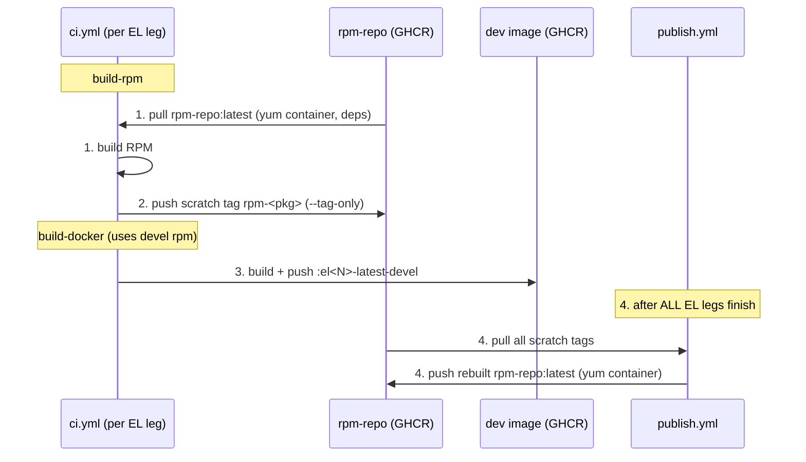

# gemini-rtsw-ci

Shared CI scripts for building RPMs and Docker dev environments. Used as a git submodule in each project repo. On every push, the pipeline builds the package's RPM, publishes it to the shared rpm-repo, and pushes a Docker dev image to GHCR.

For a step-by-step local dev workflow (clone, edit, schematics, build, commit), see [WORKFLOW.md](WORKFLOW.md).

## How the pipeline works

Each project repo pins this repo as a submodule and calls its reusable workflows. Dependencies and published RPMs both flow through one shared `rpm-repo` image on GHCR; dev images are pushed per project.


```mermaid
flowchart LR
  subgraph project["project repo"]
    spec[".spec"]
    sub["gemini-rtsw-ci<br/>(submodule)"]
    wf[".github/workflows/ci.yml"]
  end
  wf -->|"uses:"| reusable["gemini-rtsw-ci<br/>reusable workflows"]
  reusable <-->|"pull deps + publish RPM"| repo[("ghcr.io/...<br/>rpm-repo:latest")]
  reusable -->|"push dev image"| dev[("ghcr.io/...<br/>&lt;repo&gt;:el&lt;N&gt;-latest-devel")]
```

RPM dependencies are served by `ghcr.io/gemini-rtsw/rpm-repo:latest` — an nginx container hosting a yum repo of ~500 RPMs over plain HTTP. Each build:

1. **Pull deps & build** — pull and start the rpm-repo container on a Docker network, point `dnf` at it, build the RPM, then clean up.
2. **Push scratch tag** — push the built RPM as a per-package tag `ghcr.io/gemini-rtsw/rpm-repo:rpm-<pkgname>` via `upload-rpm.sh`. Per-package tags mean concurrent builds never clobber each other.
3. **Push dev image** — push to `ghcr.io/gemini-rtsw/<repo-name>:el<N>-latest-devel`, EL-scoped per matrix leg (e.g. `el8-latest-devel`, `el9-latest-devel`).
4. **Publish** — once all EL legs finish, a single `publish` job rebuilds `rpm-repo:latest` from every `rpm-*` scratch tag. One writer of `:latest`, no race.

You need to be logged in to GHCR to pull the container image; in CI `GITHUB_TOKEN` covers everything.


```mermaid
sequenceDiagram
  participant CI as ci.yml (per EL leg)
  participant Repo as rpm-repo (GHCR)
  participant Dev as dev image (GHCR)
  participant Pub as publish.yml

  Note over CI: build-rpm
  Repo->>CI: 1. pull rpm-repo:latest (yum container, deps)
  CI->>CI: 1. build RPM
  CI->>Repo: 2. push scratch tag rpm-<pkg> (--tag-only)
  Note over CI: build-docker (uses devel rpm)
  CI->>Dev: 3. build + push :el<N>-latest-devel
  Note over Pub: 4. after ALL EL legs finish
  Repo->>Pub: 4. pull all scratch tags
  Pub->>Repo: 4. push rebuilt rpm-repo:latest (yum container)
```

## Set up a new repo

1. **Add the submodule:**
   ```bash
   git submodule add -b main https://github.com/gemini-rtsw/gemini-rtsw-ci.git gemini-rtsw-ci
   git submodule update --init --recursive
   git add .gitmodules gemini-rtsw-ci
   ```

2. **Add `.github/workflows/ci.yml`:**
   ```yaml
   name: Build
   on:
     push:
       branches: [main]
     pull_request:
       branches: [main]
   jobs:
     build:
       uses: gemini-rtsw/gemini-rtsw-ci/.github/workflows/ci.yml@main
       with:
         scripts_dir: gemini-rtsw-ci
   ```

3. **Add a `.spec` file** in the repo root or `SPECS/`.

4. **Grant the repo Write access to `rpm-repo`** (required — the build reads dependencies *and* publishes its RPM):
   - Open **github.com/orgs/gemini-rtsw/packages/container/rpm-repo/settings**
   - Under **Manage Actions access** → **Add Repository**, add the new repo, role **Write**.

5. **Push.** Common failures if step 4 is missed:
   - `docker: ... denied` pulling `rpm-repo:latest` — no read access.
   - `denied: permission_denied: write_package` at publish — has read but not write.

## Local builds

Prerequisites: Docker running and logged in to GHCR. Run from the **project repo root**, not inside the submodule:

```bash
./gemini-rtsw-ci/build_rpm.sh                 # Build RPM -> rpms/
./gemini-rtsw-ci/build_docker.sh              # Build dev Docker image
./gemini-rtsw-ci/dev_environment.sh           # el8-latest-devel (default)
./gemini-rtsw-ci/dev_environment.sh --el 9    # el9-latest-devel
```

### Logging in to GHCR

Pulling the rpm-repo and dev images needs a GitHub [Personal Access Token (classic)](https://github.com/settings/tokens) with the `read:packages` scope:

1. Go to **github.com/settings/tokens** → **Generate new token (classic)**.
2. Check the **`read:packages`** scope and generate the token.
3. Log in (use the token as the password):
   ```bash
   echo "<TOKEN>" | docker login ghcr.io -u <github-username> --password-stdin
   ```

## Downloading a built RPM from GitHub Actions

Every CI run uploads the RPM(s) it built as a downloadable file, separate from the rpm-repo publish. To get it:

1. On the project's GitHub page, click the **Actions** tab (top of the page, next to **Pull requests**).
2. Click on the run you want — it's listed by commit message and branch name; the latest one is at the top.
3. On that run's page, scroll down past the job boxes to the **Artifacts** section near the bottom.
4. Click `rpms-el<N>` (e.g. `rpms-el8`) — it downloads a `.zip` file. Unzip it to get the `.rpm` file(s) inside.

## Browsing the rpm-repo directly

The rpm-repo image is a plain nginx server (port `8080`, path `/rpm-repo/`) — you can run it locally and hit it with `dnf` or `curl` without going through any of the build scripts.

**Pull and run it:**
```bash
docker login ghcr.io   # see "Logging in to GHCR" above
docker pull ghcr.io/gemini-rtsw/rpm-repo:latest
docker run -d --name rpm-repo -p 8080:8080 ghcr.io/gemini-rtsw/rpm-repo:latest
```

**Point `dnf` at it temporarily**, without adding a repo file, using `--repofrompath`:
```bash
dnf --repofrompath gemini-rtsw,http://localhost:8080/rpm-repo/ --nogpgcheck list available --repo gemini-rtsw
dnf --repofrompath gemini-rtsw,http://localhost:8080/rpm-repo/ --nogpgcheck install --repo gemini-rtsw <package-name>
```

**Or add a repo file** for a permanent setup:
```bash
sudo tee /etc/yum.repos.d/gemini-rtsw.repo <<'EOF'
[gemini-rtsw]
name=gemini-rtsw rpm-repo
baseurl=http://localhost:8080/rpm-repo/
enabled=1
gpgcheck=0
EOF

dnf list available | grep <package-name>
dnf install <package-name>
```

**Or just `curl` an RPM directly**, e.g. to grab a specific file without `dnf`:
```bash
curl -O http://localhost:8080/rpm-repo/<rpm-filename>.rpm
```

**To see what's available**, nginx has directory listing on, so browsing `http://localhost:8080/rpm-repo/` (or `curl`-ing it) shows the raw `.rpm` filenames directly.

## Custom dependency setup

If your package has tricky dependencies (wrong versions, mixed repos), add a `custom-repo-setup.sh` in your repo root. It runs automatically before dependency resolution in both RPM and Docker builds; if absent, nothing happens.

```bash
#!/bin/bash
set -e
# Example: force-install a specific package
# dnf download some-package && rpm -ivh some-package.rpm --nodeps --force
```
