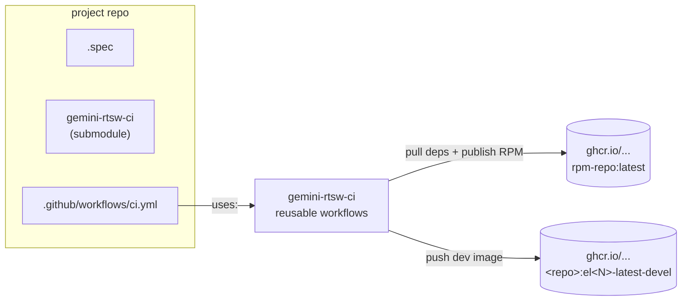
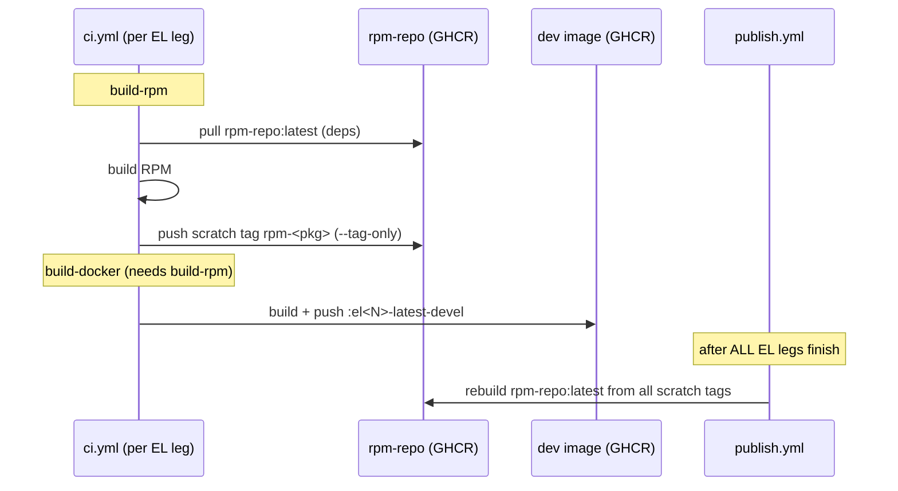

# gemini-rtsw-ci

Shared CI scripts for building RPMs and Docker dev environments. Used as a git submodule in each project repo. On every push, the pipeline builds the package's RPM, publishes it to the shared rpm-repo, and pushes a Docker dev image to GHCR.

## How the pipeline works

Each project repo pins this repo as a submodule and calls its reusable workflows. Dependencies and published RPMs both flow through one shared `rpm-repo` image on GHCR; dev images are pushed per project.


```mermaid
flowchart LR
  subgraph project["project repo"]
    spec[".spec"]
    sub["gemini-rtsw-ci<br/>(submodule)"]
    wf[".github/workflows/ci.yml"]
  end
  wf -->|"uses:"| reusable["gemini-rtsw-ci<br/>reusable workflows"]
  reusable -->|"pull deps + publish RPM"| repo[("ghcr.io/...<br/>rpm-repo:latest")]
  reusable -->|"push dev image"| dev[("ghcr.io/...<br/>&lt;repo&gt;:el&lt;N&gt;-latest-devel")]
```

RPM dependencies are served by `ghcr.io/gemini-rtsw/rpm-repo:latest` — an nginx container hosting a yum repo of ~500 RPMs over plain HTTP. Each build:

1. Pulls and starts the rpm-repo container on a Docker network, points `dnf` at it, builds, then cleans up.
2. **Publishes** the resulting RPM via `upload-rpm.sh`: each package is pushed as a per-package tag `ghcr.io/gemini-rtsw/rpm-repo:rpm-<pkgname>`, and `rpm-repo:latest` is rebuilt from all `rpm-*` tags. Per-package tags mean concurrent builds never clobber each other.
3. **Pushes a dev image** to `ghcr.io/gemini-rtsw/<repo-name>:el<N>-latest-devel`, EL-scoped per matrix leg (e.g. `el8-latest-devel`, `el9-latest-devel`).

No tokens are needed for RPM access — the repo is served over plain HTTP; GHCR login is only to pull the container image. `GITHUB_TOKEN` covers everything in CI.

The per-EL build legs run in parallel and each push only a per-package **scratch tag**; a single final `publish` job rebuilds `rpm-repo:latest` once all legs finish, so there is exactly one writer of `:latest` and no race:


```mermaid
sequenceDiagram
  participant CI as ci.yml (per EL leg)
  participant Repo as rpm-repo (GHCR)
  participant Dev as dev image (GHCR)
  participant Pub as publish.yml

  Note over CI: build-rpm
  CI->>Repo: pull rpm-repo:latest (deps)
  CI->>CI: build RPM
  CI->>Repo: push scratch tag rpm-<pkg> (--tag-only)
  Note over CI: build-docker (needs build-rpm)
  CI->>Dev: build + push :el<N>-latest-devel
  Note over Pub: after ALL EL legs finish
  Pub->>Repo: rebuild rpm-repo:latest from all scratch tags
```

## Set up a new repo

1. **Add the submodule:**
   ```bash
   git submodule add -b main https://github.com/gemini-rtsw/gemini-rtsw-ci.git gemini-rtsw-ci
   git submodule update --init --recursive
   git add .gitmodules gemini-rtsw-ci
   ```

2. **Add `.github/workflows/ci.yml`:**
   ```yaml
   name: Build
   on:
     push:
       branches: [main]
     pull_request:
       branches: [main]
   jobs:
     build:
       uses: gemini-rtsw/gemini-rtsw-ci/.github/workflows/ci.yml@main
       with:
         scripts_dir: gemini-rtsw-ci
   ```

3. **Add a `.spec` file** in the repo root or `SPECS/`.

4. **Grant the repo Write access to `rpm-repo`** (required — the build reads dependencies *and* publishes its RPM):
   - Open **github.com/orgs/gemini-rtsw/packages/container/rpm-repo/settings**
   - Under **Manage Actions access** → **Add Repository**, add the new repo, role **Write**.

5. **Push.** Common failures if step 4 is missed:
   - `docker: ... denied` pulling `rpm-repo:latest` — no read access.
   - `denied: permission_denied: write_package` at publish — has read but not write.

## Local builds

Prerequisites: Docker running and logged in to GHCR. Run from the **project repo root**, not inside the submodule:

```bash
./gemini-rtsw-ci/build_rpm.sh                 # Build RPM -> rpms/
./gemini-rtsw-ci/build_docker.sh              # Build dev Docker image
./gemini-rtsw-ci/dev_environment.sh           # el8-latest-devel (default)
./gemini-rtsw-ci/dev_environment.sh --el 9    # el9-latest-devel
```

### Logging in to GHCR

Pulling the rpm-repo and dev images needs a GitHub [Personal Access Token (classic)](https://github.com/settings/tokens) with the `read:packages` scope:

1. Go to **github.com/settings/tokens** → **Generate new token (classic)**.
2. Check the **`read:packages`** scope and generate the token.
3. Log in (use the token as the password):
   ```bash
   echo "<TOKEN>" | docker login ghcr.io -u <github-username> --password-stdin
   ```

## Custom dependency setup

If your package has tricky dependencies (wrong versions, mixed repos), add a `custom-repo-setup.sh` in your repo root. It runs automatically before dependency resolution in both RPM and Docker builds; if absent, nothing happens.

```bash
#!/bin/bash
set -e
# Example: force-install a specific package
# dnf download some-package && rpm -ivh some-package.rpm --nodeps --force
```
