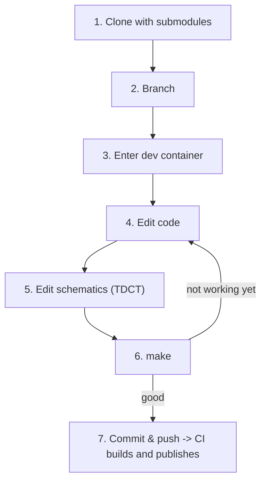

# Development workflows

How to work on a package built by this pipeline. For how the pipeline itself works, see [README.md](README.md).

In a nutshell: **clone → work (in the dev container if you need one) → push → CI builds and publishes the RPM → install it.** `build_rpm.sh` is for local testing and verification; it is never required.

Three workflows, depending on what you are building:

| | your package | start at |
|---|---|---|
| **A** | EPICS: an IOC or support module, needs the EPICS toolchain | [Workflow A](#workflow-a--epics-packages) |
| **B** | non-EPICS: config, scripts, a systemd unit, a Python service | [Workflow B](#workflow-b--non-epics-lightweight-packages) |
| **C** | ships a container that a host runs | [Workflow C](#workflow-c--shipping-a-container) |

C builds on A or B — a repo ships a container *in addition to* its RPM.

---

## Workflow A — EPICS packages

For IOCs and support modules (`mcs_mk`, `slalib`, `tcslib`, …). You develop **inside the dev image**, which is the exact environment CI builds in, so you never install the EPICS toolchain locally.



### 1. Clone

```bash
git clone --recurse-submodules <repo-url>
cd <repo-name>
```

Already cloned without submodules? `git submodule update --init --recursive`

### 2. Branch

```bash
git checkout -b <your-branch-name>
```

### 3. Enter the dev container

On macOS, first allow the container to reach your X server (TDCT needs it in step 5):

```bash
xhost +
```

```bash
./gemini-rtsw-ci/dev_environment.sh          # el8 (default)
./gemini-rtsw-ci/dev_environment.sh --el 9   # el9
```

This pulls `ghcr.io/gemini-rtsw/<repo>:el<N>-latest-devel` and drops you into a shell with the repo mounted at `/repo`. The image already contains EPICS, RTEMS and every pinned dependency of this package — it is the container CI compiled in.

Steps 4-6 run inside that shell.

### 4. Edit code

Edit anywhere — the files are the same inside and outside the container. Only steps 5 and 6 need to be inside it.

Application source lives under `<name>App/src/` (e.g. `scs-cp-iocApp/src/chopControl.h`).

### 5. Edit schematics with TDCT (if applicable)

Run TDCT from the package's `Db/` directory, against the `tdct.cfg` there:

```bash
cd scs-cp-iocApp/Db
tdct -cfg ./tdct.cfg
```

### 6. Build

```bash
make
```

Much faster than a full RPM build. Not right yet? Back to step 4.

### 7. Commit and push

```bash
git add <files>
git commit -m "<message>"
git push -u origin <your-branch-name>
```

Merging to `main` builds the RPM, publishes it to rpm-repo, and pushes a fresh dev image. **A push to `main` always publishes** — there is no flag that quietly skips it.

**Changing a dependency version?** Read the exact NVR out of the build log's `BUILD DEPENDENCY VERSIONS (pin these)` block and pin it with `%{?dist}` — see [Writing the spec](README.md#writing-the-spec).

---

## Workflow B — non-EPICS (lightweight) packages

For packages with no EPICS content: config files, scripts, a systemd unit, a Python service. The lightweight profile skips the whole EPICS apparatus — no `gemini-ade`, no rpm-repo dependency container, no dev image — which turns a multi-GB build into a fast one.

### 1. Workflow file

```yaml
name: Build
on:
  push:
    branches: [main]
  pull_request:
    branches: [main]
jobs:
  build:
    uses: gemini-rtsw/gemini-rtsw-ci/.github/workflows/ci.yml@main
    with:
      scripts_dir: gemini-rtsw-ci
      profile: lightweight
      el_version: '9'                   # one EL is usually enough; no matrix
      spec_path: packaging/foo.spec     # only if not ./*.spec or SPECS/*.spec

  publish:
    needs: build
    uses: gemini-rtsw/gemini-rtsw-ci/.github/workflows/publish.yml@main
    secrets: inherit
```

`el_version` defaults to **8**. Set it explicitly for an EL9 package.

### 2. Spec

Nothing special — an ordinary RPM spec. Two differences from Workflow A:

- **Dependencies come from the base image only** (BaseOS/AppStream). The lightweight profile does not enable EPEL, CRB/PowerTools, or the rpm-repo. If you need something from EPEL, add a `custom-repo-setup.sh` (see [README](README.md#custom-dependency-setup)).
- **No `%package devel` needed** — nothing compiles against a config package.

### 3. Develop

Edit on the host and push — there is no dev container for lightweight packages, and nothing to set up. CI builds and publishes the RPM; install it from rpm-repo.

To check a change before pushing, you can build the RPM locally. Optional:

```bash
./gemini-rtsw-ci/build_rpm.sh --profile lightweight --el 9
./gemini-rtsw-ci/build_rpm.sh --profile lightweight --spec packaging/foo.spec
```

RPMs land in `rpms/`.

---

## Workflow C — shipping a container

For a repo whose product is a container image, deployed by RPM: the RPM installs a systemd unit, the unit runs the image. Add this to Workflow A or B.

### 1. Point the workflow at your Dockerfile

```yaml
      app_image: Dockerfile        # path to the APPLICATION Dockerfile
```

### 2. Tags come from the spec, never from an argument

```
ghcr.io/gemini-rtsw/<repo>:<version>              # pin this in the unit
ghcr.io/gemini-rtsw/<repo>:<version>-git<hash>    # 1:1 with the RPM NVR
ghcr.io/gemini-rtsw/<repo>:latest
```

`build_rpm.sh` records the version it resolved and `build_app_image.sh` reads it, so the image and the RPM can never disagree. `rpm -q` shows what is deployed; `dnf downgrade` rolls both back together.

### 3. Nothing is built on the host

The pipeline builds and pushes the image. The RPM only installs a systemd unit that **pulls** it by tag — deployed hosts never build anything, which is the point of shipping this way.

Within a run the image is pushed **before** the RPM is registered, so a published RPM can never name an image that does not exist. On a pull request the image is built but not pushed, so a broken Dockerfile still fails the PR.

### 4. The host must be able to pull as root

A systemd unit runs `docker pull` as **root**, so root needs the credential — not the installing user. Simplest is to make the package public (repo → Packages → visibility). Otherwise see [README](README.md#shipping-a-container-by-rpm) for giving root the credential.

Keep `ExecStartPre=-/usr/bin/docker pull` (leading `-`) in the unit, so a registry outage cannot stop a working local image from starting.

### 5. Build it locally

```bash
./gemini-rtsw-ci/build_rpm.sh                  # first — records the version
./gemini-rtsw-ci/build_app_image.sh --no-push  # then — builds the image
```

---

## Getting a built RPM

Three ways, no local build needed:

- **From rpm-repo** — published automatically; see [README](README.md#browsing-the-rpm-repo-directly).
- **From the Actions run** — every run uploads `rpms-el<N>` as an artifact; see [README](README.md#downloading-a-built-rpm-from-github-actions).
- **Locally** — `./gemini-rtsw-ci/build_rpm.sh` from the repo root; RPMs land in `rpms/`.
