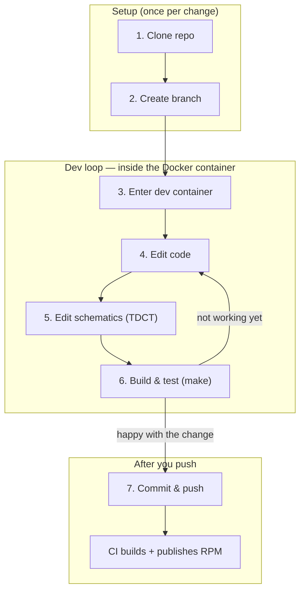

# Local development workflow

A step-by-step guide to making and testing a change in an EPICS 7 repo built on this pipeline (e.g. `softTCS_mk`). For how the CI pipeline itself works, see [README.md](README.md).



## Setup (once per change)

### 1. Clone the repo

```bash
git clone --recurse-submodules <repo-url>
cd <repo-name>
```

If you already cloned without `--recurse-submodules`:

```bash
git submodule update --init --recursive
```

### 2. Create a branch

```bash
git checkout -b <your-branch-name>
```

## Dev loop — inside the Docker container

Steps 3-6 are one loop: enter the container, edit, build, check the result, and repeat until you're happy — all before you commit anything.

### 3. Enter the dev container

On macOS, before entering, allow the container to reach your host's X server (needed for TDCT's GUI in step 5):

```bash
xhost +
```

Start the container — this pulls the latest pre-built dev image from GHCR and drops you into a shell inside it, with the repo mounted at `/repo`:

```bash
./gemini-rtsw-ci/dev_environment.sh     # defaults to el8; --el 9 for EL9
```

The container has the full EPICS toolchain already installed — nothing to set up locally. Everything below (steps 4-6) runs from inside this shell.

### 4. Edit code

Edit source as needed. (You can also do this step outside the container with your normal editor — the repo directory is the same files either way. Steps 5 and 6 still need the container.)

For example, in `softTCS_mk` (SCS), application source lives under `scs-cp-iocApp/src/` (e.g. `scs-cp-iocApp/src/chopControl.h`).

### 5. Edit schematics with TDCT (if applicable)

TDCT is a GUI tool; run it from the package's `Db/` directory, against the `tdct.cfg` found there. For example, in `softTCS_mk` (SCS):

```bash
cd scs-cp-iocApp/Db
tdct -cfg ./tdct.cfg
```

### 6. Build and test (`make`)

Compile to check your change before committing — this is faster than a full RPM build. From the repo root (e.g. `scs_cp/`):

```bash
make
```

Not working yet? Go back to step 4. Happy with it? Move on to committing.

## After you push

### 7. Commit and push

```bash
git add <files>
git commit -m "<message>"
git push -u origin <your-branch-name>
```

Pushing triggers CI (`ci.yml`) for that branch/PR: it builds the RPM, publishes it as a scratch tag (`ghcr.io/gemini-rtsw/rpm-repo:rpm-<pkgname>-el<N>`), and pushes a dev image. See [README.md](README.md#how-the-pipeline-works) for the full pipeline flow.

### 8. Get the RPM CI built (optional)

Two ways, without needing to build it yourself:

- **From the rpm-repo** (published automatically) — see [README.md](README.md#browsing-the-rpm-repo-directly).
- **From the GitHub Actions run**, via the web page:
  1. Open the repo on github.com and click the **Actions** tab.
  2. Click the workflow run for your branch/PR.
  3. Scroll to the **Artifacts** section at the bottom of the run summary.
  4. Click `rpms-el<N>` (e.g. `rpms-el8`) to download a `.zip` containing the RPM(s).

### 9. Build the RPM locally (optional)

Skip CI entirely and build on your own machine — useful for a quick check before pushing, or if you don't want to wait on CI. From the **project repo root** on the host (not inside the submodule):

```bash
./gemini-rtsw-ci/build_rpm.sh
```

Produces the package RPM(s) in `rpms/` in the repo root — the same RPMs CI builds, just kept on your machine instead of published. See [README.md](README.md#local-builds) for prerequisites (Docker running, logged in to GHCR).
