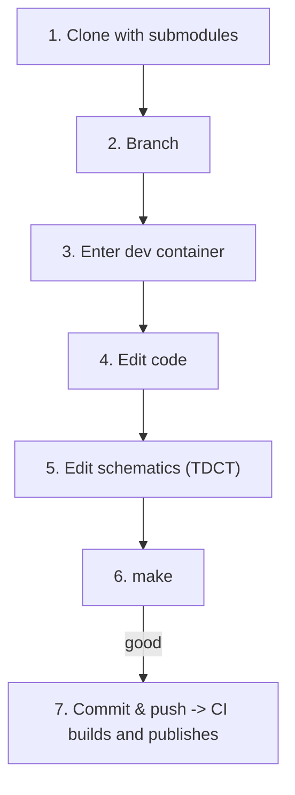

# Development workflows

How to work on a package already built by this pipeline. **Creating or migrating a repo** is in [README.md](README.md#start-a-new-repo) — it has cut-and-paste templates for every file you need.

In a nutshell: **clone → work (in the dev container if you need one) → push → CI builds and publishes the RPM → install it.** `build_rpm.sh` is for local testing and verification; it is never required.

Three workflows, depending on what you are building:

| | your package | start at |
|---|---|---|
| **A** | EPICS: an IOC or support module, needs the EPICS toolchain | [Workflow A](#workflow-a--epics-packages) |
| **B** | non-EPICS: config, scripts, a systemd unit, a Python service | [Workflow B](#workflow-b--non-epics-lightweight-packages) |
| **C** | ships a container that a host runs | [Workflow C](#workflow-c--shipping-a-container) |

C builds on A or B — a repo ships a container *in addition to* its RPM.

---

## Workflow A — EPICS packages

For IOCs and support modules (`mcs_mk`, `slalib`, `tcslib`, …). You develop **inside the dev image**, which is the exact environment CI builds in, so you never install the EPICS toolchain locally.



### 1. Clone

```bash
git clone --recurse-submodules <repo-url>
cd <repo-name>
```

Already cloned without submodules? `git submodule update --init --recursive`

### 2. Branch

```bash
git checkout -b <your-branch-name>
```

### 3. Enter the dev container

On macOS, first allow the container to reach your X server (TDCT needs it in step 5):

```bash
xhost +
```

```bash
./gemini-rtsw-ci/dev_environment.sh          # el8 (default)
./gemini-rtsw-ci/dev_environment.sh --el 9   # el9
```

This pulls `ghcr.io/gemini-rtsw/<repo>:el<N>-latest-devel` and drops you into a shell with the repo mounted at `/repo`. The image already contains EPICS, RTEMS and every pinned dependency of this package — it is the container CI compiled in.

Steps 4-6 run inside that shell.

### 4. Edit code

Edit anywhere — the files are the same inside and outside the container. Only steps 5 and 6 need to be inside it.

Application source lives under `<name>App/src/` (e.g. `scs-cp-iocApp/src/chopControl.h`).

### 5. Edit schematics with TDCT (if applicable)

Run TDCT from the package's `Db/` directory, against the `tdct.cfg` there:

```bash
cd scs-cp-iocApp/Db
tdct -cfg ./tdct.cfg
```

### 6. Build

```bash
make
```

Much faster than a full RPM build. Not right yet? Back to step 4.

### 7. Commit and push

```bash
git add <files>
git commit -m "<message>"
git push -u origin <your-branch-name>
```

Merging to `main` builds the RPM, publishes it to rpm-repo, and pushes a fresh dev image. **A push to `main` always publishes** — there is no flag that quietly skips it.

**Changing a dependency version?** Read the exact NVR out of the build log's `BUILD DEPENDENCY VERSIONS (pin these)` block and pin it with `%{?dist}` — see [Writing the spec](README.md#writing-the-spec).

---

## Workflow B — non-EPICS (lightweight) packages

Config files, scripts, a systemd unit, a Python service. No EPICS toolchain, so the loop is shorter: there is nothing to compile before you push.

### 1. Clone

```bash
git clone --recurse-submodules <repo-url>
cd <repo-name>
git checkout -b <your-branch-name>
```

### 2. Edit and push

Edit on the host with your normal editor. Then:

```bash
git add <files>
git commit -m "<message>"
git push -u origin <your-branch-name>
```

Merging to `main` builds and publishes the RPM.

### 3. Install it

```bash
sudo dnf install <name>          # or: sudo dnf upgrade <name>
rpm -q <name>                    # confirms the exact build you are running
```

### 4. Check it before pushing (optional)

Build the RPM locally:

```bash
./gemini-rtsw-ci/build_rpm.sh --profile lightweight --el 9
```

RPMs land in `rpms/`. Or open the dev container — the build environment with your package already installed, which is the place to confirm files landed where you expected:

```bash
./gemini-rtsw-ci/dev_environment.sh --el 9    # match the EL your package builds for
```

---

## Workflow C — repos that ship a container

The repo builds a container image *and* an RPM. The RPM installs a systemd unit; the unit pulls the image and runs it. Nothing is ever built on the deployed host — which is what makes this work on a closed network.

Add Workflow A or B for the code loop; this is what is different.

### 1. What CI does on a push to `main`

1. builds the RPM and the dev image, as always
2. builds your `Dockerfile` and pushes it, tagged from the spec version
3. registers the RPM

That order is deliberate: the image is pushed **before** the RPM registers, so a published RPM can never name an image that does not exist. On a pull request the image is built but not pushed, so a broken Dockerfile still fails the PR.

### 2. Tags come from the spec, never from an argument

```
ghcr.io/gemini-rtsw/<repo>:<version>              # what the unit pins
ghcr.io/gemini-rtsw/<repo>:<version>-git<hash>    # 1:1 with the RPM NVR
ghcr.io/gemini-rtsw/<repo>:latest                 # convenience; never pin this
```

Bump the version in the spec and both the RPM and the image move together. `rpm -q` tells you which image a host runs; `dnf downgrade` is a real rollback.

### 3. Deploy to a host

```bash
sudo dnf upgrade <name>
sudo systemctl restart <service>     # the new image takes effect on restart
systemctl status <service>
```

The unit pulls on start, so the first restart after an upgrade fetches the new image. **Root must be able to pull it** — the unit runs `docker pull` as root, not as you. Simplest is to make the package public; otherwise see [README](README.md#shipping-a-container-by-rpm).

### 4. Build the image locally (optional)

```bash
./gemini-rtsw-ci/build_rpm.sh                  # first — records the version
./gemini-rtsw-ci/build_app_image.sh --no-push  # then — builds the image
```

---

## Getting a built RPM

Three ways, no local build needed:

- **From rpm-repo** — published automatically; see [README](README.md#browsing-the-rpm-repo-directly).
- **From the Actions run** — every run uploads `rpms-el<N>` as an artifact; see [README](README.md#downloading-a-built-rpm-from-github-actions).
- **Locally** — `./gemini-rtsw-ci/build_rpm.sh` from the repo root; RPMs land in `rpms/`.
