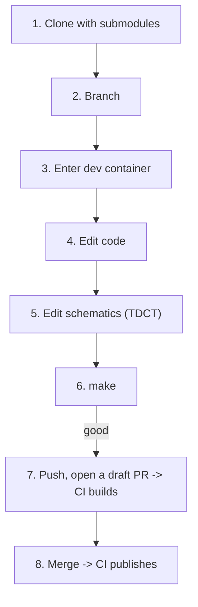

# Development workflows

How to work on a package already built by this pipeline. **Creating or migrating a repo** is in [README.md](README.md#start-a-new-repo) — start a new one by copying a [template repo](README.md#quickest-copy-a-template-repo) (`template-epics`, `template-lightweight`, `template-container`), or use its cut-and-paste templates to add the pipeline to an existing repo.

In a nutshell: **clone → work (in the dev container if you need one) → push → CI builds and publishes the RPM → install it.** `build_rpm.sh` is for local testing and verification; it is never required.

## Three levels of development

The same build runs at every level. What changes is who runs it and whether the result is published.

| | how | who runs the build | result |
|---|---|---|---|
| **1. Local** | `dev_environment.sh`, `make`, `build_rpm.sh` | you, on your machine | RPMs in `rpms/`, dev image in your local Docker |
| **2. Draft PR** | push to a branch with a draft PR open | CI, on every push | RPMs as an `rpms-el<N>` artifact on the run |
| **3. Merge to `main`** | merge the PR | CI | the official build: RPM published to rpm-repo, dev image pushed |

**Levels 1 and 2 build the same thing.** A PR build runs `build_rpm.sh` in the same containers you get locally. Locally you run it yourself; on a PR, CI runs it for you on every push. Neither publishes anything, so you can iterate freely at both. The one difference: locally the scripts come from your project's pinned submodule, while CI uses `gemini-rtsw-ci` `main` (see [Local builds](README.md#local-builds)).

**Only level 3 is official.** Nothing reaches rpm-repo or the shared dev image until it is merged.

Use level 1 for fast iteration, level 2 to confirm it builds in CI and to hand an RPM to someone to test, and level 3 to release.

Three workflows, depending on what you are building:

| | your package | start at |
|---|---|---|
| **A** | EPICS: an IOC or support module, needs the EPICS toolchain | [Workflow A](#workflow-a--epics-packages) |
| **B** | non-EPICS: config, scripts, a systemd unit, a Python service | [Workflow B](#workflow-b--non-epics-lightweight-packages) |
| **C** | ships a container that a host runs | [Workflow C](#workflow-c--shipping-a-container) |

C builds on A or B — a repo ships a container *in addition to* its RPM.

---

## Workflow A — EPICS packages

For IOCs and support modules (`mcs_mk`, `slalib`, `tcslib`, …). You develop **inside the dev image**, which is the exact environment CI builds in.


```mermaid
flowchart TD
  A["1. Clone with submodules"] --> B["2. Branch"]
  B --> C["3. Enter dev container"]
  C --> D["4. Edit code"]
  D --> E["5. Edit schematics (TDCT)"]
  E --> F["6. make"]
  F -->|"good"| G["7. Push, open a draft PR -> CI builds"]
  G --> H["8. Merge -> CI publishes"]
```

### 1. Clone

```bash
git clone --recurse-submodules <repo-url>
cd <repo-name>
```

Already cloned without submodules? `git submodule update --init --recursive`

### 2. Branch

```bash
git checkout -b <your-branch-name>
```

### 3. Enter the dev container

On macOS, first allow the container to reach your X server (TDCT needs it in step 5):

```bash
xhost +
```

```bash
./gemini-rtsw-ci/dev_environment.sh          # el8 (default)
./gemini-rtsw-ci/dev_environment.sh --el 9   # el9
```

This pulls `ghcr.io/gemini-rtsw/<repo>:el<N>-latest-devel` and drops you into a shell with the repo mounted at `/repo`. The image already contains EPICS, RTEMS and every pinned dependency of this package — it is the container CI compiled in.

If the container needs environment variables the image does not set — `GEMINI_TOP` and `GEMINI_SITE` for a DM screen repo, say — put them in a `custom_env_setup.sh` in your repo root and `dev_environment.sh` will forward them in. See [Custom container environment](README.md#custom-container-environment) for what it can and cannot set; `PATH` in particular has to come from your spec.

Steps 4-6 run inside that shell.

### 4. Edit code

Edit anywhere — the files are the same inside and outside the container. Only steps 5 and 6 need to be inside it.

Application source lives under `<name>App/src/` (e.g. `scs-cp-iocApp/src/chopControl.h`).

### 5. Edit schematics with TDCT (if applicable)

Run TDCT from the package's `Db/` directory, against the `tdct.cfg` there:

```bash
cd scs-cp-iocApp/Db
tdct -cfg ./tdct.cfg
```

### 6. Build

```bash
make
```

Much faster than a full RPM build. Not right yet? Back to step 4.

### 7. Push and open a draft PR

```bash
git add <files>
git commit -m "<message>"
git push -u origin <your-branch-name>
```

Then open a **draft** pull request on GitHub. CI builds it on every push — see [Pull requests](#pull-requests-what-ci-does). A pushed branch with no PR is not built.

### 8. Merge

Merging to `main` builds the RPM, publishes it to rpm-repo, and pushes a fresh dev image.

---

## Workflow B — non-EPICS (lightweight) packages

Config files, scripts, a systemd unit, a Python service. No EPICS toolchain, so the loop is shorter: there is nothing to compile before you push.

### 1. Clone

```bash
git clone --recurse-submodules <repo-url>
cd <repo-name>
git checkout -b <your-branch-name>
```

### 2. Edit and push

Edit on the host with your normal editor. Then:

```bash
git add <files>
git commit -m "<message>"
git push -u origin <your-branch-name>
```

Open a draft pull request to have CI build it, then merge to `main` to publish — see [Pull requests](#pull-requests-what-ci-does).

### 3. Check it before pushing (optional)

Build the RPM locally:

```bash
./gemini-rtsw-ci/build_rpm.sh --profile lightweight --el 9
```

RPMs land in `rpms/`. Or open the dev container — the build environment with your package already installed, which is the place to confirm files landed where you expected:

```bash
./gemini-rtsw-ci/dev_environment.sh --el 9    # match the EL your package builds for
```

---

## Workflow C — repos that ship a container

The repo builds a container image *and* an RPM. The RPM installs a systemd unit; the unit runs the image, which a docker-group user pulls onto the host (the unit falls back to pulling as `software`, never root). Nothing is ever built on the deployed host — which is what makes this work on a closed network.

Add Workflow A or B for the code loop; this is what is different.

### 1. What CI does on a push to `main`

1. builds the RPM and the dev image, as always
2. builds your `Dockerfile` and pushes it, tagged from the spec version
3. registers the RPM

That order is deliberate: the image is pushed **before** the RPM registers, so a published RPM can never name an image that does not exist. On a pull request the image is built but not pushed, so a broken Dockerfile still fails the PR.

### 2. Tags come from the spec, never from an argument

```
ghcr.io/gemini-rtsw/<repo>:<version>              # moves with every build of that version
ghcr.io/gemini-rtsw/<repo>:<version>-git<hash>    # 1:1 with the RPM NVR -- what the unit pins
ghcr.io/gemini-rtsw/<repo>:latest                 # convenience; never pin this
```

Bump the version in the spec and both the RPM and the image move together. `rpm -q` tells you which image a host runs; `dnf downgrade` is a real rollback.

**Pin `<version>-git<hash>`, not `<version>`.** A bare `:<version>` is retagged by every build of that version, so pinning it makes `dnf downgrade` a no-op for the image: the RPM moves back, the host keeps pulling whatever last claimed the tag. See [Shipping a container by RPM](README.md#shipping-a-container-by-rpm).

### 3. Deploy to a host

```bash
docker pull ghcr.io/gemini-rtsw/<repo>:<version>-git<hash>   # as yourself (docker group), no sudo
sudo dnf upgrade <name>
sudo systemctl restart <service>     # the new image takes effect on restart
systemctl status <service>
```

**`dnf` does not pull the image, and root never does.** Pull it yourself first. If you forget, the unit pulls the missing image as the `software` user on start. Hosts without `software` give you the exact `docker pull` to run. See [Host requirement](README.md#shipping-a-container-by-rpm).

### 4. Build the image locally (optional)

```bash
./gemini-rtsw-ci/build_rpm.sh                  # first — records the version
./gemini-rtsw-ci/build_app_image.sh --no-push  # then — builds the image
```

---

## Pull requests: what CI does

Open your PR as a **draft** while you work. Drafts and ready PRs build the same way.

**Every push to the PR runs the full build:** RPM, dev image, and app image if the repo has one. A build that would fail on `main` fails here first.

**Nothing is published.** No RPM goes to rpm-repo, no dev image or app image is pushed, and the other `main` jobs (such as `publish`) are skipped. You can push to a draft as often as you like: it costs build time only and never touches what other people install.

**To test the result, download it from the run.** Each run keeps its RPMs as an `rpms-el<N>` artifact — see [Downloading a built RPM](README.md#downloading-a-built-rpm-from-github-actions). Install it on a test host with `dnf install ./<file>.rpm`.

**The dev container still comes from `main`.** Because a PR pushes no dev image, `dev_environment.sh` gives you the one `main` last published — it pulls `:el<N>-latest-devel` on every start. Usually that is what you want: your checkout is mounted at `/repo`, so `make` builds your branch's files whichever image you are in; the image only supplies the toolchain and the installed package. To work in *your branch's* environment instead — to check a change to the spec's `BuildRequires` or `%install`, say — build the image locally and start it without the pull, which would otherwise replace it with `main`'s:

```bash
./gemini-rtsw-ci/build_rpm.sh --el 9               # tags the dev image locally, under the same name
./gemini-rtsw-ci/dev_environment.sh --el 9 --no-pull
```

**Merge to publish.** When the PR merges, the build on `main` publishes the RPM and the dev image.

See [Three levels of development](#three-levels-of-development) for how this compares with a local build and a merge.

---

## Getting a built RPM

Three ways, no local build needed:

- **From rpm-repo** — `main` builds only; see [README](README.md#browsing-the-rpm-repo-directly).
- **From the Actions run** — every run, PRs included, uploads `rpms-el<N>` as an artifact; see [README](README.md#downloading-a-built-rpm-from-github-actions).
- **Locally** — `./gemini-rtsw-ci/build_rpm.sh` from the repo root; RPMs land in `rpms/`.
